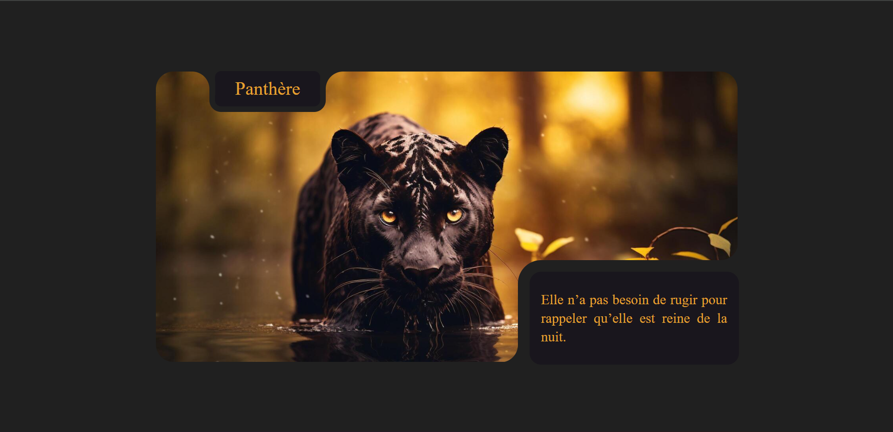

# 🐆 Inverted Border Project – Panthère

Un petit projet d’entraînement en **HTML & CSS** autour d’un design inspiré de la **panthère noire**.  
Ce projet met en avant un **effet de bordures inversées** sur un titre et une citation, avec une image en arrière-plan.

---

## 🚀 Live Demo

👉 [Voir la page en ligne](https://anya-git.github.io/inverted-border/)

---

## 📂 Repository

👉 [Accéder au repo GitHub](https://github.com/AnYa-git/inverted-border.git)

---

## ✨ Aperçu

- Image de fond en **pleine largeur**
- **Titre stylisé** avec effet de bordure inversée
- **Citation poétique** dans un encadré
- Design sombre et élégant inspiré de la **panthère noire**

---

## 🛠️ Technologies utilisées

- **HTML5**
- **CSS3**

---

## 📸 Screenshot

---

## 📚 Objectif

Apprentissage et pratique de l’intégration web avec :

- Positionnement absolu et relatif
- Création d’effets graphiques avec `::before` et `::after`
- Expérimentation de styles originaux (bordures inversées)

---

✍️ Créé avec ❤️ par **Anya**
